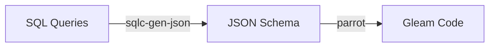

# 🦜 Parrot / type-safe SQL in gleam

[](https://hex.pm/packages/parrot)
[](https://hexdocs.pm/parrot/)


## Introduction

### Features

✅ Supports SQlite, PostgreSQL and MySQL<br />
✅ Utility wrappers for popular gleam database libraries ([lpil/sqlight](https://github.com/lpil/sqlight), [lpil/pog](https://github.com/lpil/pog))<br />
✅ Named parameters<br />
✅ Automatically downloads required binary ([sqlc](https://sqlc.dev/))

*Most of these features are provided by / built into sqlc, so I do not aim to take credit for them.*

## Usage

### Installation
```sh
$ gleam add parrot
```

### If you target JavaScript

So here is the catch: you can only execute parrot in an erlang gleam application.
However the generated code will also run in a javascript environment.
So if you need parrot for a javascript project, you can create a separate package and
copy over the generated module and that will work.

### Define your Queries
- Parrot will look for all *.sql files in any sql directory under your project's src directory.
- Each *.sql file can contain as many SQL queries as you want.
- All of the queries will compile into a single `src/[project name]/sql.gleam` module.

Here are some links to help you start out, if you are unfamiliar with the [sqlc](https://sqlc.dev/) annotation syntax:
- [Getting started with MySQL](https://docs.sqlc.dev/en/stable/tutorials/getting-started-mysql.html)
- [Getting started with PostgreSQL](https://docs.sqlc.dev/en/stable/tutorials/getting-started-postgresql.html)
- [Getting started with SQlite](https://docs.sqlc.dev/en/stable/tutorials/getting-started-sqlite.html)

### Code Generation
```sh
# automatically detects database & engine
$ gleam run -m parrot

# specify sqlite file
$ gleam run -m parrot --sqlite <file_path>

# see all options
$ gleam run -m parrot help
```

If you use MySQL, you also need [mysqldump](https://dev.mysql.com/doc/refman/9.0/en/mysqldump.html) (comes per default if you have a mysql client installed)

If you use PostgreSQL, you also need [pg_dump](https://www.postgresql.org/docs/current/app-pgdump.html) (comes per default if you have a postgresql client installed)

## How it works

This library makes use of a [sqlc-gen-json plugin](https://github.com/daniellionel01/sqlc-gen-json),
which it then converts into gleam code.

So in a simplified manner, the pipeline looks like this:


### Examples

If you want to see how this works in action, take a look at the integration tests:
- PostgreSQL Test using [lpil/pog](https://github.com/lpil/pog): [./integration_test/psql](./integration_test/psql)
- MySQL Test using [ninanomenon/shork](https://github.com/ninanomenon/shork): [./integration_test/mysql](./integration_test/mysql)
- SQlite Test using [lpil/sqlight](https://github.com/lpil/sqlight): [./integration_test/sqlite](./integration_test/sqlite)

## Development

### Database

There are scripts to spawn a MySQL or PostgreSQL docker container:
-  [MySQL Script](./bin/mysql.sh)
-  [PostgreSQL Script](./bin/psql.sh)

For example:
```sh
$ ./bin/mysql.sh
# or
$ ./bin/psql.sh
```

### Integration Test Suite
```sh
$ just test-sqlite
$ just test-mysql
$ just test-psql
```

## FAQ

### What flavour of SQL does parrot support?
This library supports everything that [sqlc](https://sqlc.dev/) supports. As the time of this writing that
would be MySQL, PostgreSQL and SQlite.

You can read more on language & SQL support here:
https://docs.sqlc.dev/en/stable/reference/language-support.html

### What sqlc features are not supported?
- embeddeding structs (https://docs.sqlc.dev/en/stable/howto/embedding.html)

## Future Work

Here are some ideas and thoughts on how you might develop this library further:
* automatic pull request for new sqlc versions
* dedicated packages for dependencies that might not be required (f.e. `pog`, `sqlight`)
* support more complex postgres data types (`path`, `point`, `polygon`)
* provide way to configure custom decoders for json columns

Contributions are welcomed!

## Acknowledgements
- This project was heavily inspired by `squirrel` ([Hex](https://hex.pm/packages/squirrel), [GitHub](https://github.com/giacomocavalieri/squirrel)). Thank you [@giacomocavalieri](https://github.com/giacomocavalieri)!
- Thank you to `sqlc` ([GitHub](https://github.com/sqlc-dev/sqlc), [Website](https://sqlc.dev/))
