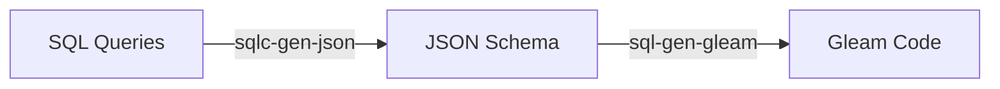

# SQL -> Gleam (sqlc-gen-gleam)

[](https://hex.pm/packages/sqlc_gen_gleam)
[](https://hexdocs.pm/sqlc_gen_gleam/)

# Project Status

**this project is currently pre-alpha. it will be released under v1.0.0 once ready for usage.**

# How it works

This library makes use of a [sqlc-gen-json plugin](https://github.com/daniellionel01/sqlc-gen-json),
which it then converts into gleam code.

So in a simplified manner, the pipeline looks like this:


## An Example

Let's take the following SQL queries as an example:
```sql
-- name: GetAuthor :one
SELECT
  *
FROM
  authors
WHERE
  id = ?
LIMIT
  1;

-- name: ListAuthors :many
SELECT
  *
FROM
  authors
ORDER BY
  name;
```

The `--name: GetAuthor :one` comment is part of sqlc and will be used to generate the
name and return type of the wrapper.

Given the queries above, the following code will be generated:

```gleam
//// file: src/gen/sqlc_mysql.gleam

import gleam/option.{type Option}

pub type GetAuthor {
  GetAuthor(
    id: Int,
    created_at: Int,
    name: String,
    bio: Option(String)
  )
}
pub fn get_author_sql(id: Int) {
  let sql = "
  SELECT
    *
  FROM
    authors
  WHERE
    id = ?
  LIMIT
    1;
  "

  #(sql, #(id))
}

pub type ListAuthorRow {
  ListAuthorRow(
    id: Int,
    created_at: Int,
    name: String,
    bio: Option(String)
  )
}
pub type ListAuthors = List(ListAuthorRow)
pub fn list_authors_sql(id: Int) {
  let sql = "
  SELECT
    *
  FROM
    authors
  ORDER BY
    name;
  "

  #(sql, Nil)
}
```

Every SQL query wrapper follows the schema of #(SQL, Params). So the first element is
the raw SQL that can be executed by your database driver and the second element is a
tuple of all of the parameters that you need for this query.

If you're using one of the supported drivers, we can also generate the query execution
parsing of the return type for you. If you are using a custom driver, you will have to
do that yourself using the [gleam/dynamic](https://hexdocs.pm/gleam_stdlib/gleam/dynamic.html)
package.

# Supported Drivers

- MySQL: https://github.com/VioletBuse/gmysql
- PostgreSQL: https://github.com/lpil/pog
- SQlite: https://github.com/lpil/sqlight

# Usage

1. Install
```sh
$ gleam add sqlc_gen_gleam@1
```

2. Setup sqlc

Now setup your `sqlc.yaml`, `schema.sql` and `query.sql` like in any other sqlc project.

Here are some links to help you start out:
- [Getting started with MySQL](https://docs.sqlc.dev/en/stable/tutorials/getting-started-mysql.html)
- [Getting started with PostgreSQL](https://docs.sqlc.dev/en/stable/tutorials/getting-started-postgresql.html)
- [Getting started with SQlite](https://docs.sqlc.dev/en/stable/tutorials/getting-started-sqlite.html)

2. Generate Gleam code
```sh
# we first need the json from sqlc
$ sqlc generate

# then we use this library to turn it into gleam code
$ gleam run -m sqlc_gen_gleam
```

Further documentation can be found at <https://hexdocs.pm/sqlc_gen_gleam>.

# Development

## 1. Database

There are scripts to spawn MySQL or PostgreSQL docker container:
-  [MySQL Script](./scripts/mysql/docker.sh)
-  [PostgreSQL Script](./scripts/psql/docker.sh)

For example:
```sh
$ ./scripts/mysql/docker.sh
# or
$ ./scripts/psql/docker.sh
```

## 2. Generating the JSON schema
This library uses the JSON schema, generated by [sqlc](https://sqlc.dev/), to generate gleam code.
To generate the JSON with the example schema & queries:
```sh
$ ./scripts/sqlc.sh # wrapper for "sqlc generate" with additional parameters
```

## 3. Running the project and tests
```sh
$ gleam run   # Run the project
$ gleam test  # Run the tests
```

# FAQ

### What flavour of SQL does sqlc-gen-gleam support?
This plugin supports everything that sqlc supports. As the time of this writing that
would be MySQL, PostgreSQL and SQlite.

You can read more on language & SQL support here:
https://docs.sqlc.dev/en/stable/reference/language-support.html

### What sqlc features are not supported?
- embeddeding structs (https://docs.sqlc.dev/en/stable/howto/embedding.html)

# Development

## Tests

You can run a suite of integration tests via the module [./test/integration_test.gleam](./test/integration_test.gleam).
You can run this module with this script:
```sh
$ ./scripts/integration-test.sh
```

# Acknowledgements
- This project was heavily inspired by `squirrel` ([Hex](https://hex.pm/packages/squirrel), [GitHub](https://github.com/giacomocavalieri/squirrel)). Thank you [@giacomocavalieri](https://github.com/giacomocavalieri)!
- Thank you to `sqlc` ([GitHub](https://github.com/sqlc-dev/sqlc), [Website](https://sqlc.dev/))
- Thank you to `dedent` ([GitHub](https://github.com/MystPi/dedent), [Hex](https://hexdocs.pm/dedent/))

# License
[Apache License, Version 2.0](./LICENSE)
