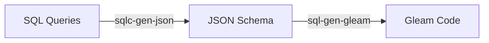

# SQL -> Gleam (sqlc-gen-gleam)

[](https://hex.pm/packages/sqlc_gen_gleam)
[](https://hexdocs.pm/sqlc_gen_gleam/)

# Project Status

**this project is currently pre-alpha. it will be released under v1.0.0 once ready for usage.**

# How it works

This library makes use of a [sqlc-gen-json plugin](https://github.com/daniellionel01/sqlc-gen-json),
which it then converts into gleam code.

So in a simplified manner, the pipeline looks like this:


# Usage

1. Install
```sh
$ gleam add sqlc_gen_gleam@1
```

2. Setup sqlc

Now setup your `sqlc.yaml`, `schema.sql` and `query.sql` like in any other sqlc project.

Here are some links to help you start out:
- [Getting started with MySQL](https://docs.sqlc.dev/en/stable/tutorials/getting-started-mysql.html)
- [Getting started with PostgreSQL](https://docs.sqlc.dev/en/stable/tutorials/getting-started-postgresql.html)
- [Getting started with SQlite](https://docs.sqlc.dev/en/stable/tutorials/getting-started-sqlite.html)

2. Generate Gleam code
```sh
# we first need the json from sqlc
$ sqlc generate

# then we use this library to turn it into gleam code
$ gleam run -m sqlc_gen_gleam
```

Further documentation can be found at <https://hexdocs.pm/sqlc_gen_gleam>.

# Development

## 1. Database

There are scripts to spawn MySQL or PostgreSQL docker container:
-  [MySQL Script](./scripts/mysql/docker.sh)
-  [PostgreSQL Script](./scripts/psql/docker.sh)

For example:
```sh
$ ./scripts/mysql/docker.sh
# or
$ ./scripts/psql/docker.sh
```

## 2. Generating the JSON schema
This library uses the JSON schema, generated by [sqlc](https://sqlc.dev/), to generate gleam code.
To generate the JSON with the example schema & queries:
```sh
$ ./scripts/sqlc.sh # wrapper for "sqlc generate" with additional parameters
```

## 3. Running the project and tests
```sh
$ gleam run   # Run the project
$ gleam test  # Run the tests
```

# Acknowledgements
- This project was heavily inspired by `squirrel` ([Hex](https://hex.pm/packages/squirrel), [GitHub](https://github.com/giacomocavalieri/squirrel)). Thank you [@giacomocavalieri](https://github.com/giacomocavalieri)!
- Thank you to `sqlc` ([GitHub](https://github.com/sqlc-dev/sqlc), [Website](https://sqlc.dev/))

# License
[Apache License, Version 2.0](./LICENSE)

# Currently unsupported sqlc functionality

- embeddeding structs (https://docs.sqlc.dev/en/stable/howto/embedding.html)
