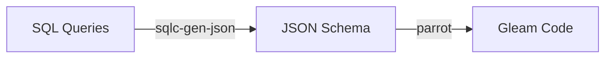

# How it works

This library makes use of a [sqlc-gen-json plugin](https://github.com/daniellionel01/sqlc-gen-json),
which it then converts into gleam code.

So in a simplified manner, the pipeline looks like this:

